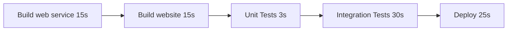

# ParallelWorkflowsDemo
A demo to show parallel workflow benefits

Simple workflow to build, test, then deploy our app. (total time: 1m 38s)


Using parallel workflows
```mermaid
  graph LR;
      buildWeb[Build web service 15s]-->test
      buildWebService[Build website 15s]-->test;
      test-->unitTest[Unit Tests 3s]-->deploy;
      test-->integrationTest[Integration Tests 30s]-->deploy;
      deploy-->deployWebService[Deploy web service 25s]-->smoke[Smoke test 30s];
      deploy-->deployWeb[Deploy website 25s]-->smoke[Smoke test 30s];
      smoke[Smoke test 30s]-->swap[Swap blue green (10s)]
```