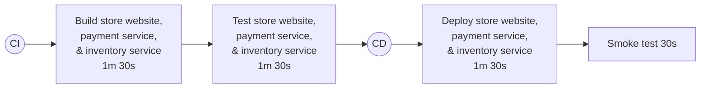
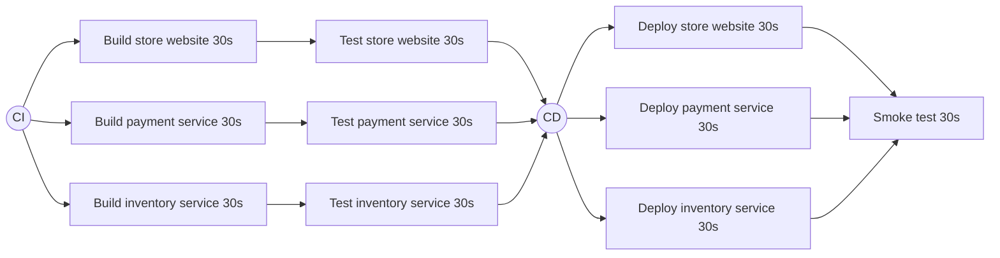

# ParallelWorkflowsDemo
A demo to show parallel workflow benefits

Simple workflow to build, test, then deploy our app. (total time: ~6mins)

Using a parallel workflow on the same dataset (~3mins)

