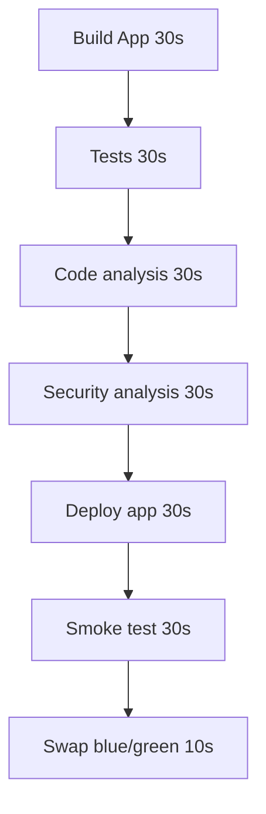
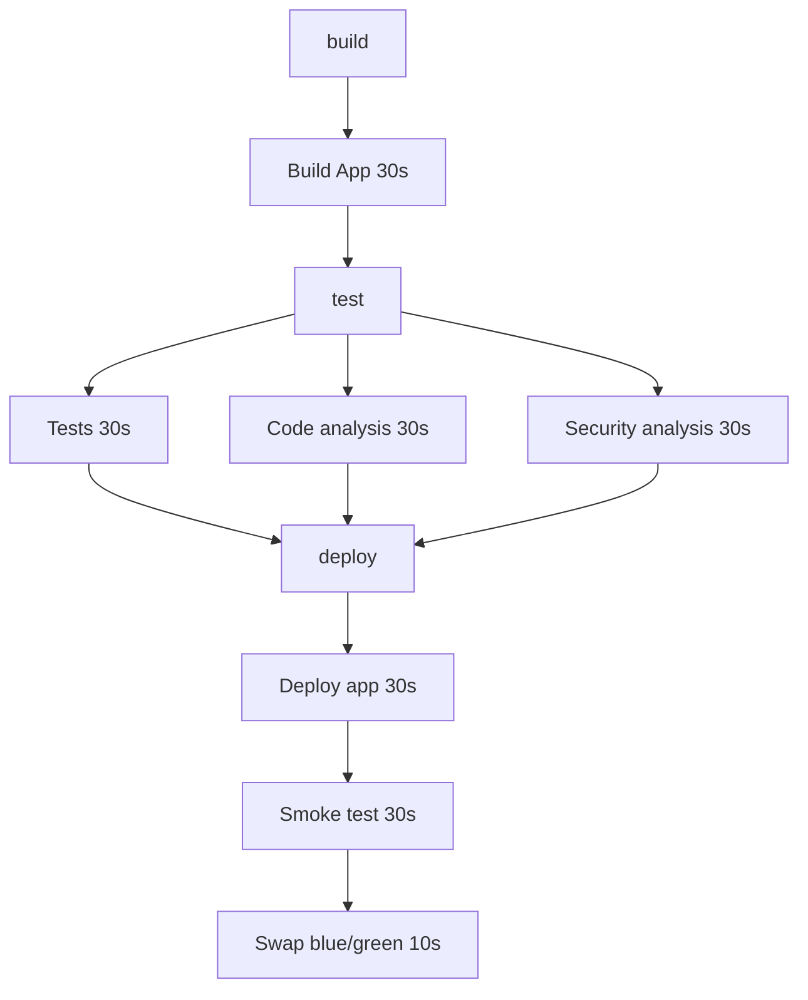

# ParallelWorkflowsDemo
A demo to show parallel workflow benefits

Simple workflow to build, test, then deploy our app. (total time: 1m 38s)

```mermaid
  graph TD;
      buildApp[Build App 30s]-->tests[Tests 30s]-->codeAnalysis[Code analysis 30s]-->securityAnalysis[Security analysis 30s]-->deployApp[Deploy app 30s]-->smoke[Smoke test 30s]-->swap[Swap blue/green 10s];
```

Using parallel workflows

```mermaid
  graph TD;
      build-->buildApp[Build App 30s]-->test
      test-->tests[Tests 30s]-->deploy;
      test-->codeAnalysis[Code analysis 30s]-->deploy;
      test-->securityAnalysis[Security analysis 30s]-->deploy;
      deploy-->deployApp[Deploy app 30s]-->smoke[Smoke test 30s];
      smoke[Smoke test 30s]-->swap[Swap blue/green 10s];
```
