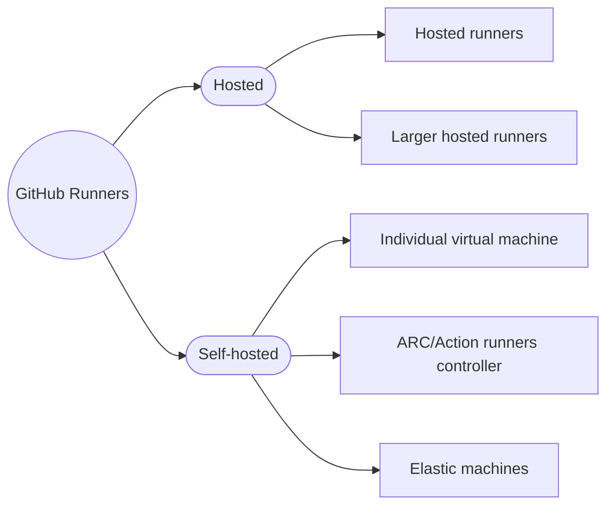

```mermaid
  graph LR;
      root((GitHub Runners))-->hosted([Hosted]);
      root((GitHub Runners))-->selfhosted([Self-hosted]);
      hosted([Hosted])-->hostedRunners[Hosted runners];
      hosted([Hosted])-->largerHostedRunners[Larger hosted runners];
      selfhosted([Self-hosted])-->selfHostedRunnersVM[Individual virtual machine];
      selfhosted([Self-hosted])-->selfHostedRunnersARC[ARC/Action runners controller];
      selfhosted([Self-hosted])-->selfHostedRunnersEM[Elastic machines];
```
